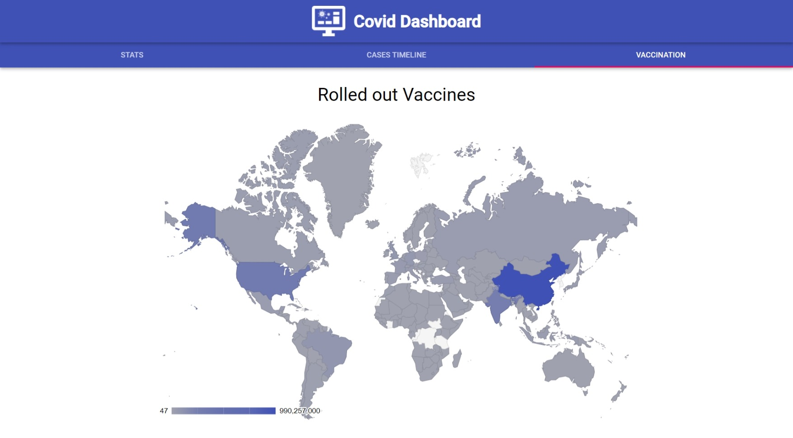

# Covid Dashboard

_This project is developed as a pre-interview assessment_

A simple Covid-19 stats dashboard.

## Screenshots




## Tech

[React.js](https://reactjs.org/) <br>
[Material UI](https://material-ui.com/) <br>
[React Google Charts](https://react-google-charts.com/) <br>
[disease.sh API](https://disease.sh/) <br>

## To run the code

Install dependencies

```
npm i
```

Run Development Server

```
npm start
```
